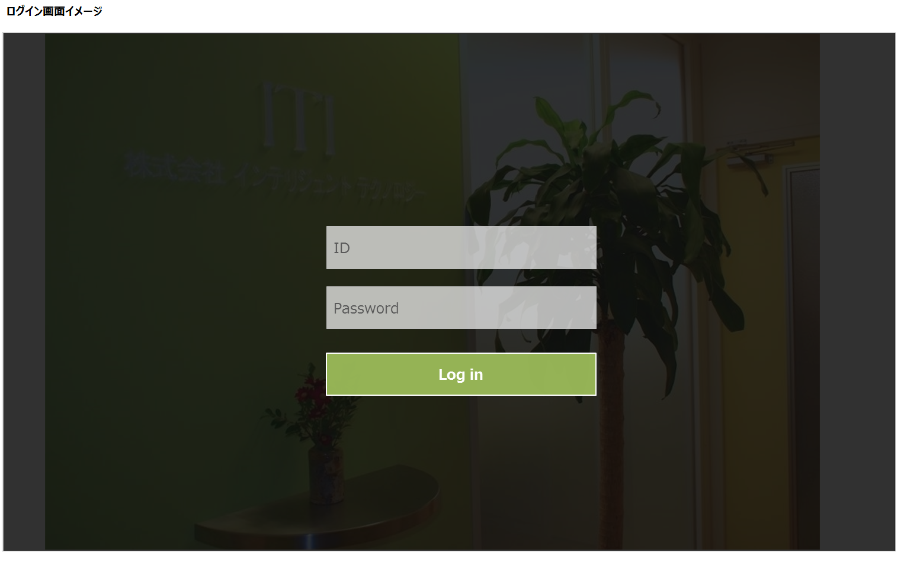
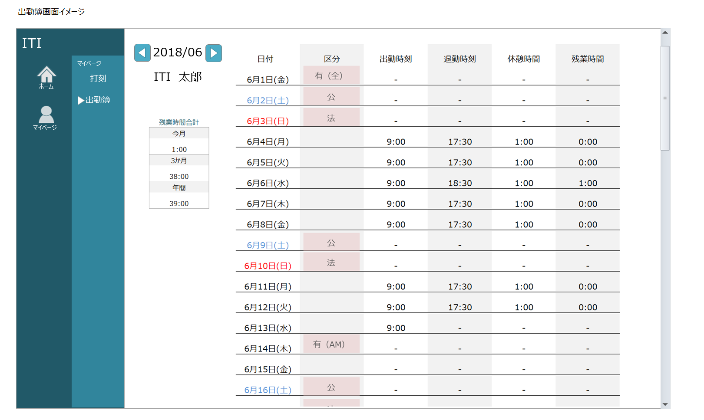
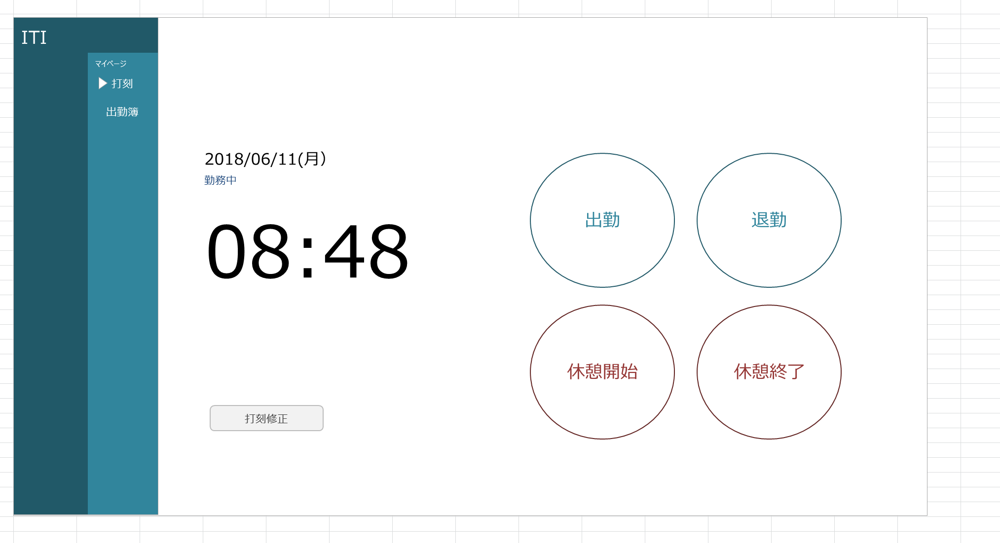
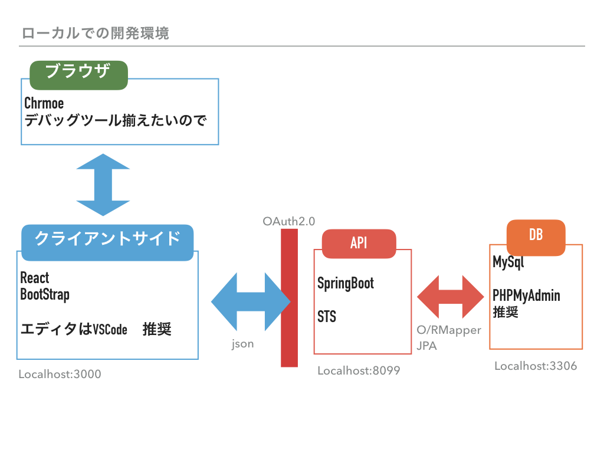

# 実装役割分担

## 画面イメージ

---

## HTML,CSS
ReactのComponentごとに分担  
1. ログインとサイトバー
1. 月移動と残業時間表示
1. 打刻
1. 勤怠一覧表示

実装方針  
1. ハードコーディングでいいので画面を作る（HTML、CSSを書く）
1. どの部分を変数にしたらユーザー、日付で変更できるか要素を考える
1. 値をどのように受け取れば画面描画できるか考えてReactのComponentを実装（レンダリグ）する。

## React,Redux
Reduxのお作法になれる
1. actionを洗い出す。
画面遷移が発生する箇所（ボタン）、サーバーとのやりとりが必要になる箇所を考える、（タイミングも）
1. 受け取るjsonを考える？？、サーバーの人とHTMLの人と連携して  

Reduxのライフサイクルに慣れることを優先で。

## 認証
OAuth2.0 のサンプルを動かすことを目標に。  
Filterを自分で作成するのでなく、アノテーションを使ってSpringSecurityを呼び出す方法について調べる。  

## サーバーサイド
urlごとに分担を振るので、Controller,Service,DAOを一通り実装する。  
テーブル設計は適宜考える。  
(正規化について勉強中なので一緒にやりたい人はやりましょう)  

---
### その他
とりあえず各自で実装してみて分からないことがあったらその都度聞いてください。何が分からないかを分かることを第１目標に。  
今後は全員参加でなくていいので、月２回開催にして、実装を進めていこうと思います。  
そのうちペアプロもやりましょう。

---
### 開発環境
Java8世代 でお願いします。

---
## 参考URL
### VisualCode  
- [拡張機能](https://qiita.com/sensuikan1973/items/74cf5383c02dbcd82234)

### CSS
- http://photoshopvip.net/109893
- http://photoshopvip.net/109622

### Redux
- [公式ドキュメント](https://redux.js.org/)
- [処理の流れ１](https://qiita.com/mgoldchild/items/5be49ea49ebc2e4d9c55)
- [処理の流れ２](https://qiita.com/mpyw/items/a816c6380219b1d5a3bf)
- [tips](https://qiita.com/y_kawase/items/8f1b5a303400a09c4923)
- [初めて読んだやつ](https://qiita.com/tkow/items/9da7062f9bfa99e848c3)

### Chrome
- [ディベロッパーツール使い方基本](https://qiita.com/d-dai/items/0b580b26bb1d1622eb46)

### OAuth

### SpringBoot